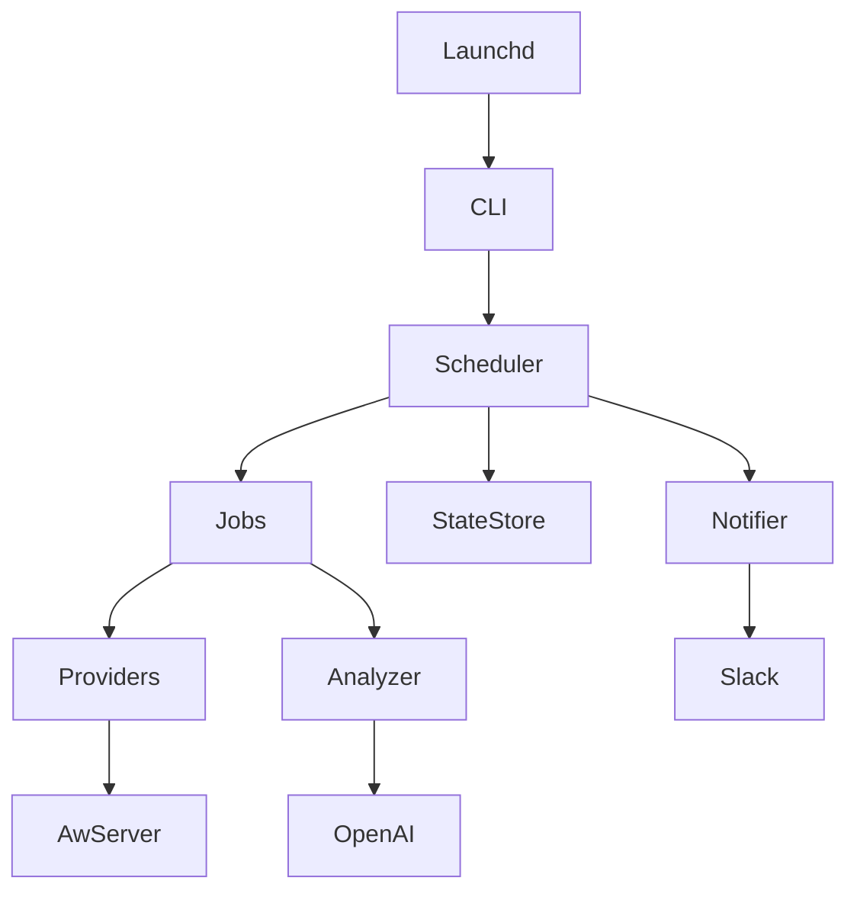
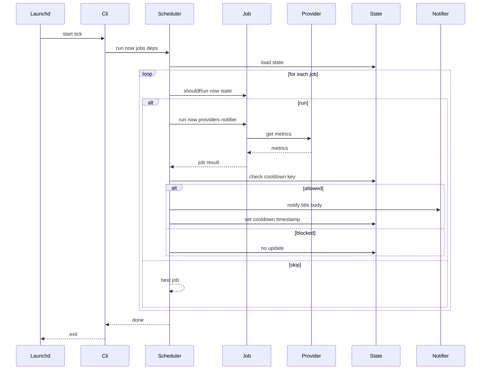
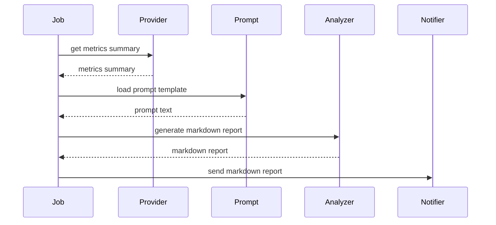

# Technical Design: aw-analyzer

## Overview

aw-analyzer は macOS 上で定期的に起動される “tick 型 CLI” として、ActivityWatch 等から活動データを取得し、定義された Job（ルール）を評価して必要な通知のみを実行する。常駐プロセスを避けるため、1回の起動で「ジョブ判定→必要なI/O→状態更新→終了」を完結し、再実行に強い冪等性と cooldown を中心に設計する。

本拡張では、取得したメトリクス/要約を入力として AI に分析させ、見やすい Markdown レポートを生成する。生成したレポートは Notifier 抽象を介して Slack（Incoming Webhook）等に送信できる。AI/Slack はいずれも外部I/Oのため、Ports & Adapters の境界に閉じて差し替え可能にする（テストではスタブへ置換）。

本設計は Hexagonal（Ports & Adapters）を採用し、Job（Domain）から ActivityWatch API と macOS 通知を完全に隔離する。ActivityWatch 側は API が未凍結である旨が明記されているため、Provider が bucket 選定・クエリ組み立て・レスポンスパースを吸収できる契約に固定し、仕様差分による修正範囲を局所化する。

### Goals

- plist 1枚・tick 1本の運用を前提に、CLI が即終了する実行モデルを提供する
- Job/Provider/Notifier を疎結合に保ち、任意条件の通知を追加可能にする
- cooldown と状態管理により、連発防止と日次などの冪等性を担保する
- ActivityWatch が利用できない環境でも、fixture と差し替えで決定的にテスト可能にする
- メトリクス/要約を元に Markdown レポートを生成し、Slack 等へ送信できる（オプション）

### Non-Goals

- 常駐デーモンや常時 WebSocket 接続の実装
- GUI（Web/UI）提供
- ActivityWatch サーバー側の設定変更やデータ書き換え（読み取り中心）

## Architecture

### Architecture Pattern & Boundary Map



**Architecture Integration**:

- Selected pattern: Hexagonal（Ports & Adapters）
- Domain/feature boundaries:
  - Domain: Job（通知条件評価・通知文生成）
  - Ports: Provider / Notifier / StateStore / Clock / Analyzer / PromptRepository
  - Adapters: ActivityWatchProvider / JxaNotifier / SlackWebhookNotifier / JsonFileStateStore / SystemClock / OpenAiAnalyzer / FilePromptRepository
- Steering compliance: Bun 実行、DI による外部依存抽象化、決定的評価、常駐回避

### Technology Stack

| Layer                 | Choice / Version                 | Role in Feature        | Notes                        |
| --------------------- | -------------------------------- | ---------------------- | ---------------------------- |
| CLI                   | TypeScript                       | `tick` のエントリ      | ESM / strict                 |
| Runtime               | Bun                              | 実行環境               | `fetch` を標準 HTTP とする   |
| Data / Storage        | JSON file                        | 状態永続化             | 連発防止・冪等に利用         |
| OS Integration        | JXA (`@jxa/run`)                 | macOS 通知             | Adapter で封印し差し替え可能 |
| External API          | ActivityWatch REST               | 活動データ取得         | Provider が API 差分を吸収   |
| External Notification | `@slack/webhook`                 | Slack Incoming Webhook | Slack 向け Notifier Adapter  |
| AI                    | OpenAI JavaScript SDK (`openai`) | レポート生成           | Analyzer Adapter（外部I/O）  |

## System Flows





**Flow-level decisions**

- AI/Slack が失敗した場合の扱いは Job 単位で選択可能とし、設計上は Job の `run` 結果（success/failure）と Scheduler のエラー分類で吸収する。
- プライバシー要件（10.1, 10.6）により、Analyzer に渡す入力は “生データ” ではなく集約済み（メトリクス/要約）に限定する。

## Requirements Traceability

> 要件IDは `N.M` とし、N は `Requirement N`、M は当該 Requirement の Acceptance Criteria 番号（1-5）に対応する。

| Requirement | Summary                        | Components                                  | Interfaces   | Flows           |
| ----------- | ------------------------------ | ------------------------------------------- | ------------ | --------------- |
| 1.x         | tick 起動・即終了              | CLI, Scheduler                              | Batch, State | Tick sequence   |
| 2.x         | Job 実行制御                   | Scheduler, Job                              | Service      | Tick sequence   |
| 3.x         | 通知抽象                       | NotifierPort, JxaNotifier                   | Service      | Tick sequence   |
| 4.x         | cooldown/冪等                  | Scheduler, StateStore                       | State        | Tick sequence   |
| 5.x         | 状態永続化                     | StateStorePort, JsonFileStateStore          | State        | Tick sequence   |
| 6.x         | Provider 抽象/AW 連携          | ActivityProviderPort, ActivityWatchProvider | Service, API | Tick sequence   |
| 7.x         | メトリクス算出                 | MetricsCalculator, ActivityWatchProvider    | Service      | Tick sequence   |
| 8.x         | 起動頻度上限前提のスケジュール | Scheduler, SchedulePolicy                   | Service      | Tick sequence   |
| 9.x         | ログ/診断                      | LoggerPort                                  | Service      | Tick sequence   |
| 10.x        | ローカル運用/プライバシー      | Provider, State                             | API, State   | Tick sequence   |
| 11.x        | テスト容易性                   | Ports, InMemory adapters                    | Service      | N A             |
| 12.x        | AI 分析とレポート生成          | AnalyzerPort, OpenAiAnalyzer, ReportJob     | Service      | Report sequence |
| 13.x        | Markdown フォーマット          | ReportFormatter, PromptRepository           | Service      | Report sequence |
| 14.x        | Slack 等への配信               | SlackWebhookNotifier                        | Service      | Report sequence |

## Components and Interfaces

### Component Summary

| Component             | Domain/Layer | Intent                                       | Req Coverage     | Key Dependencies (P0/P1)                       | Contracts             |
| --------------------- | ------------ | -------------------------------------------- | ---------------- | ---------------------------------------------- | --------------------- |
| CLI                   | App          | 引数解釈し Scheduler を起動して終了          | 1.x, 9.x         | Scheduler (P0), Logger (P1)                    | Batch                 |
| Scheduler             | Core         | Job 実行、cooldown 判定、状態更新            | 1.x-5.x, 8.x     | StateStore (P0), Notifier (P0), Providers (P0) | Service, State, Batch |
| Job                   | Domain       | 条件評価と通知文生成                         | 2.x-4.x, 7.x     | Providers (P0)                                 | Service               |
| ActivityProviderPort  | Port         | メトリクス取得契約                           | 6.x, 7.x         | -                                              | Service               |
| ActivityWatchProvider | Adapter      | ActivityWatch API/Query を吸収しメトリクス化 | 6.x, 7.x         | HttpClient (P0), Logger (P1)                   | API, Service          |
| NotifierPort          | Port         | 通知契約                                     | 3.x              | -                                              | Service               |
| JxaNotifier           | Adapter      | macOS 通知を実装                             | 3.x              | Logger (P1)                                    | Service               |
| SlackWebhookNotifier  | Adapter      | Slack へ Markdown レポートを送信             | 14.x, 10.2, 10.7 | SlackWebhookClient (P0), Logger (P1)           | Service               |
| StateStorePort        | Port         | 永続状態の読み書き                           | 4.x, 5.x         | -                                              | State                 |
| JsonFileStateStore    | Adapter      | JSON ファイルで永続化                        | 5.x              | FileSystem (P0)                                | State                 |
| ClockPort             | Port         | 現在時刻                                     | 1.x, 8.x         | -                                              | Service               |
| LoggerPort            | Port         | ログ出力                                     | 9.x              | -                                              | Service               |
| AnalyzerPort          | Port         | メトリクス入力から Markdown レポート生成     | 12.x, 10.1, 10.6 | -                                              | Service               |
| OpenAiAnalyzer        | Adapter      | OpenAI を用いたレポート生成                  | 12.2, 12.3       | OpenAI SDK (P0)                                | Service               |
| PromptRepositoryPort  | Port         | Prompt テキストの供給                        | 12.x, 13.x       | -                                              | State                 |
| FilePromptRepository  | Adapter      | ファイルから Prompt を読み出す               | 12.x, 13.x       | FileSystem (P0)                                | State                 |
| ReportFormatter       | Domain       | Markdown 形への整形（決定的）                | 13.x             | -                                              | Service               |

### Core

#### Scheduler

| Field        | Detail                                                      |
| ------------ | ----------------------------------------------------------- |
| Intent       | tick 内で実行すべきジョブを決定し、通知と状態更新を統制する |
| Requirements | 1.2, 1.3, 1.4, 2.2, 2.3, 4.1, 4.2, 5.2, 8.1                 |

**Responsibilities & Constraints**

- `shouldRun` の評価順序と実行順序は決定的である
- cooldown 判定は “通知直前” に行い、通知できた場合のみ更新する
- Provider/Notifier/StateStore の失敗を分類し、ログと終了コードに反映する

**Dependencies**

- Outbound: `Job` — 実行対象（P0）
- Outbound: `StateStorePort` — 状態永続化（P0）
- Outbound: `NotifierPort` — 通知（P0）
- Outbound: `LoggerPort` — ログ（P1）
- Outbound: `ClockPort` — 時刻（P1）

**Contracts**: Service [x] / API [ ] / Event [ ] / Batch [x] / State [x]

##### Service Interface

```typescript
export type JobId = string;

export type JobResult =
  | { type: "no_notify"; reason: string }
  | { type: "notify"; title: string; body: string; cooldownKey?: string };

export type SchedulerRunResult =
  | { type: "ok"; executedJobs: JobId[]; notifiedJobs: JobId[] }
  | { type: "error"; error: SchedulerError };

export type SchedulerError =
  | { type: "configuration_error"; message: string }
  | { type: "provider_error"; message: string; jobId?: JobId }
  | { type: "notifier_error"; message: string; jobId?: JobId }
  | { type: "state_error"; message: string };

export interface SchedulerService {
  runTick(input: { now: Date; jobs: Job[] }): Promise<SchedulerRunResult>;
}

export interface Job {
  id: JobId;
  shouldRun(ctx: JobContext): Promise<boolean> | boolean;
  run(ctx: JobContext): Promise<JobResult>;
}

export interface JobContext {
  now: Date;
  state: StateStorePort;
  providers: ProvidersPort;
  notifier: NotifierPort;
  logger: LoggerPort;
}
```

##### Batch / Job Contract

- Trigger: launchd からの `tick` 起動
- Input / validation: CLI 引数、設定、状態ファイル
- Output / destination: 通知の発火、状態更新、ログ
- Idempotency & recovery: 日次キーと cooldown により冪等

##### State Management

- State model: key-value（JSON）で `cooldown:*` や `daily:*` を保持
- Persistence & consistency: 1 tick 単位の直列更新（同時実行は想定しないが、破損耐性を持たせる）
- Concurrency strategy: 同時起動が起きた場合は “最後に書いたものが勝つ” になりうるため、将来的にロックを検討

### Domain

#### Job Definitions

| Field        | Detail                                    |
| ------------ | ----------------------------------------- |
| Intent       | “通知するかどうか” と “通知文” を決定する |
| Requirements | 2.1-2.5, 3.1-3.3, 4.1-4.4, 7.1-7.5        |

**Responsibilities & Constraints**

- Job は Provider/Notifier の具象に依存しない（Port のみ）
- Job は deterministic（同一入力で同一結果）を目指す

**Contracts**: Service [x] / API [ ] / Event [ ] / Batch [ ] / State [ ]

##### Service Interface

```typescript
export type DailyMetrics = {
  workSeconds: number;
  afkSeconds: number;
  nightWorkSeconds: number;
  maxContinuousSeconds: number;
  topApps: Array<{ app: string; seconds: number }>;
};

export interface ActivityProviderPort {
  getDailyMetrics(input: { start: Date; end: Date; nightStart: Date; nightEnd: Date }): Promise<DailyMetrics>;
  getTodayMetrics(input: { start: Date; end: Date; nightStart: Date; nightEnd: Date }): Promise<DailyMetrics>;
}

export interface ProvidersPort {
  activity: ActivityProviderPort;
}
```

#### ReportJob（Markdown レポート生成）

| Field        | Detail                                                      |
| ------------ | ----------------------------------------------------------- |
| Intent       | メトリクス/要約を入力に Markdown レポートを生成して通知する |
| Requirements | 12.1, 12.2, 12.3, 13.1, 13.2, 14.1                          |

**Responsibilities & Constraints**

- Analyzer に渡す入力は集約済みデータに限定し、生データを送らない（10.1, 10.6）。
- Prompt を別ファイルとして管理し、Job から PromptRepository を介して取得する（変更容易性）。
- AI を使わない代替生成（決定的なフォーマット）を設計上のフォールバックとして保持する（12.3）。

**Dependencies**

- Outbound: `ProvidersPort` — メトリクス入力（P0）
- Outbound: `AnalyzerPort` — Markdown 生成（P0）
- Outbound: `PromptRepositoryPort` — Prompt 取得（P0）
- Outbound: `NotifierPort` — 配信（P0）
- Outbound: `ReportFormatter` — フォールバック生成（P1）

**Contracts**: Service [x] / API [ ] / Event [ ] / Batch [ ] / State [ ]

### Infra Adapters

#### ActivityWatchProvider

| Field        | Detail                                                                  |
| ------------ | ----------------------------------------------------------------------- |
| Intent       | ActivityWatch API と query 言語の差分を吸収し DailyMetrics に正規化する |
| Requirements | 6.1-6.5, 7.1-7.5, 10.1-10.4                                             |

**Responsibilities & Constraints**

- bucket 探索（`find_bucket` 相当）と query 文字列構築を内部に隠蔽する
- API 仕様差分に備え、HTTP 失敗・パース失敗を “provider_error” として返せる
- ActivityWatch が unavailable の場合は “安全な失敗” を選べる（ジョブ単位の失敗/全体中断は設定で制御）

**Dependencies**

- External: ActivityWatch REST (`/api/0/buckets/`, `/api/0/buckets/<id>/events`, `/api/0/query`)（P0）
- Outbound: `HttpClientPort`（P0）
- Outbound: `LoggerPort`（P1）

**Contracts**: Service [x] / API [x] / Event [ ] / Batch [ ] / State [ ]

##### Service Interface

```typescript
export type HttpMethod = "GET" | "POST";

export type HttpResponse<T> =
  | { type: "ok"; status: number; value: T }
  | { type: "error"; status?: number; message: string };

export interface HttpClientPort {
  request<T>(input: {
    method: HttpMethod;
    url: string;
    headers?: Record<string, string>;
    jsonBody?: unknown;
  }): Promise<HttpResponse<T>>;
}

export type ActivityWatchConfig = {
  baseUrl: string;
  apiPrefix: string;
  queryName?: string;
};
```

##### API Contract

| Method | Endpoint                   | Request             | Response         | Errors                 |
| ------ | -------------------------- | ------------------- | ---------------- | ---------------------- |
| GET    | /api/0/buckets/            | none                | buckets metadata | network, non-2xx       |
| GET    | /api/0/buckets/{id}/events | query params        | raw events       | 404 not found, non-2xx |
| POST   | /api/0/query               | query + timeperiods | query result     | 400 bad query, non-2xx |

> `/api/0/query` の最新仕様はローカル aw-server の API playground を参照し、差分は Provider 内で吸収する。

#### NotifierPort and JxaNotifier

| Field        | Detail                                              |
| ------------ | --------------------------------------------------- |
| Intent       | 通知を抽象化し、macOS 通知を Adapter として実装する |
| Requirements | 3.1-3.5                                             |

**Contracts**: Service [x] / API [ ] / Event [ ] / Batch [ ] / State [ ]

##### Service Interface

```typescript
export type NotifyOptions = { soundName?: string };

export interface NotifierPort {
  notify(input: {
    title: string;
    body: string;
    options?: NotifyOptions;
  }): Promise<{ type: "ok" } | { type: "error"; message: string }>;
}
```

#### SlackWebhookNotifier

| Field        | Detail                                                |
| ------------ | ----------------------------------------------------- |
| Intent       | Slack Incoming Webhook へ Markdown レポートを送信する |
| Requirements | 14.1, 14.2, 14.3, 10.2, 10.7                          |

**Responsibilities & Constraints**

- Slack Webhook URL は設定で差し替え可能にする（14.2）。
- 送信内容は “要約/集約レポート” を前提とし、詳細イベント等の生データを扱わない（10.1, 10.6）。

**Dependencies**

- External: Slack Incoming Webhook (`@slack/webhook`)（P0）
- Outbound: `LoggerPort`（P1）

**Contracts**: Service [x] / API [ ] / Event [ ] / Batch [ ] / State [ ]

##### Service Interface

```typescript
export type SlackWebhookConfig = {
  webhookUrl: string;
  username?: string;
  iconEmoji?: string;
};

export type SlackMrkdwnText = { type: "mrkdwn"; text: string };
export type SlackSectionBlock = { type: "section"; text: SlackMrkdwnText };
export type SlackBlock = SlackSectionBlock;

export type SlackMessage = {
  text: string;
  blocks?: SlackBlock[];
};

export interface SlackWebhookClientPort {
  send(input: { message: SlackMessage }): Promise<{ type: "ok" } | { type: "error"; message: string }>;
}
```

**Implementation Notes**

- Integration: Slack SDK の型/送信形式は `research.md` に記録し、Adapter では送信成否のみを上位へ返す。
- Validation: Webhook URL の未設定は configuration error として早期検出する。
- Risks: Webhook の失効・レート制限・Slack 側障害は notifier_error へ分類しログに残す。

#### StateStorePort and JsonFileStateStore

| Field        | Detail                                      |
| ------------ | ------------------------------------------- |
| Intent       | cooldown と日次冪等のための状態を永続化する |
| Requirements | 4.1-4.5, 5.1-5.5                            |

**Contracts**: Service [ ] / API [ ] / Event [ ] / Batch [ ] / State [x]

##### State Management

- State model:
  - `cooldown:<jobId>`: epoch ms
  - `daily:lastDate:<jobId>`: YYYY-MM-DD
- Persistence & consistency:
  - 1 tick 実行の中で read-modify-write を完結する
  - 状態ファイルの保存先は設定で変更可能

##### Service Interface

```typescript
export interface StateStorePort {
  get<T>(key: string): Promise<T | undefined>;
  set<T>(key: string, value: T): Promise<void>;
  getTime(key: string): Promise<number | undefined>;
  setTime(key: string, epochMs: number): Promise<void>;
}
```

#### AnalyzerPort and OpenAiAnalyzer

| Field        | Detail                                                 |
| ------------ | ------------------------------------------------------ |
| Intent       | 集約済みメトリクス入力から Markdown レポートを生成する |
| Requirements | 12.2, 12.3, 12.4, 10.1, 10.6                           |

**Responsibilities & Constraints**

- 入力は “集約済みの DTO” に限定し、生データを送らない（10.1）。
- Analyzer の失敗は Job がフォールバック生成へ切り替え可能（12.3）。
- テストではスタブ Analyzer を注入し決定的な出力を得る（12.5）。

**Dependencies**

- External: OpenAI API（P0）
- External: OpenAI JavaScript SDK (`openai`)（P0）
- Outbound: `LoggerPort`（P1）

**Contracts**: Service [x] / API [ ] / Event [ ] / Batch [ ] / State [ ]

##### Service Interface

```typescript
export type ReportInput = {
  period: { start: Date; end: Date };
  metrics: DailyMetrics;
};

export type AnalyzerError =
  | { type: "configuration_error"; message: string }
  | { type: "upstream_error"; message: string }
  | { type: "invalid_response"; message: string };

export interface AnalyzerPort {
  generateMarkdownReport(input: {
    reportInput: ReportInput;
    prompt: string;
  }): Promise<{ type: "ok"; markdown: string } | { type: "error"; error: AnalyzerError }>;
}
```

#### PromptRepositoryPort and FilePromptRepository

| Field        | Detail                                                        |
| ------------ | ------------------------------------------------------------- |
| Intent       | Prompt を別ファイルとして管理し、Job から取得できるようにする |
| Requirements | 12.1, 13.1, 13.3                                              |

**Responsibilities & Constraints**

- Prompt の読み出しは I/O だが、内容は固定ファイルとしテストでは差し替え可能にする。
- Prompt の欠落は configuration error として扱える。
- Prompt ファイルはリポジトリ内の専用ディレクトリ（例: `src/prompts/`）に集約し、変更・レビューしやすくする。

**Dependencies**

- Outbound: `FileSystemPort`（P0）

**Contracts**: Service [ ] / API [ ] / Event [ ] / Batch [ ] / State [x]

##### State Management

- State model: `{ [promptName]: string }`（読み出し専用）
- Persistence & consistency: リポジトリ内ファイルを参照し、実行時は読み取りのみ

##### Service Interface

```typescript
export type PromptName = "daily_report";

export interface PromptRepositoryPort {
  getPrompt(input: { name: PromptName }): Promise<{ type: "ok"; prompt: string } | { type: "error"; message: string }>;
}
```

## Data Models

### Domain Model

- Aggregate: `TickRun`（1回の起動単位）
- Entities: `Job`, `JobResult`
- Value objects: `DailyMetrics`, `CooldownKey`
- Invariants:
  - cooldown 更新は通知成功時のみ
  - Job の実行順は決定的

### Logical Data Model

- `DailyMetrics` は Provider が返す “正規化後の DTO” であり、Job は ActivityWatch の raw events を知らない
- 状態ストアは key-value のみで、スキーマの進化に耐える（未知キーを保持してもよい）

## Error Handling

### Error Strategy

- 境界（CLI/Provider/Notifier/State）で入力検証し、正常系エラーは Result 形で上位に返す
- 予期しない例外は CLI 外周で捕捉して終了コードに反映する

### Monitoring

- `tick` 開始/終了、ジョブ実行/スキップ理由、外部I/O失敗を LoggerPort 経由で記録する

## Testing Strategy

- Unit Tests:
  - `Scheduler` の cooldown 判定と状態更新（InMemoryStateStore）
  - Job の `shouldRun` / `run` の決定性（FixtureProvider）
  - Range 計算やフォーマット等の純粋関数
- Integration Tests:
  - Scheduler + Job + InMemoryNotifier + FixtureProvider の end-to-end（ネットワークなし）
  - Provider の query 文字列生成（文字列 snapshot）
- E2E (manual):
  - ローカル aw-server が起動している環境で `tick` を実行し通知が出ることを確認
  - Slack Webhook を有効にしてレポートが Markdown として送信されることを確認

## Supporting References (Optional)

- 詳細な discovery と根拠: `research.md`
